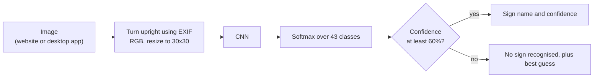

# Traffic Sign Recognition CNN

Our final year B.Tech (Computer Engineering) project at S.S.V.P.S.'s B.S. Deore College of Engineering, Dhule (2021-22).
By Neel Borse, Yashwant Patil, Kadambari Jadhav and Dipika Patil, guided by Prof. B. R. Mandre.
Project report title: "Deep Learning for Large-Scale Traffic-Sign Detection and Recognition".

In this project we trained a convolutional neural network (CNN) to recognise 43 types of traffic sign from the German Traffic Sign
Recognition Benchmark (GTSRB). We also built a website and a desktop app so anyone can try the model on their own images.
Our model recognises 95.1% of the GTSRB test images.



## Project structure

| Path | What it is |
|---|---|
| `Dataset/` | GTSRB images: `Train/0` to `Train/42` (39,209 images), `Test/` (12,630 images, labels in `Test.csv`) and `Meta/` (one example per class) |
| `algo/tsr.py` | Class names, image loading, preprocessing and prediction, shared by the scripts below |
| `algo/train.py` | Trains our CNN, saves it to `algo/model/TSR.keras` and writes graphs and test metrics to `algo/results/` |
| `algo/Traffic_app.py` | Flask server for our website, including the `/predict` endpoint used by the Prediction page |
| `algo/gui.py` | Our desktop app (Tkinter) |
| `algo/model/TSR.keras` | Our trained model |
| `algo/results/` | Accuracy/loss graphs, confusion matrix and test metrics for the trained model |
| `algo/Traffic_sign_detection.ipynb` | Google Colab notebook version of the training. It expects the dataset on Google Drive; use `train.py` to train locally |
| `website/` | Home, Abstract, Prediction and Conclusion pages, served by `Traffic_app.py` |
| `website/prototype/` | UI prototype of the website (PDF and exported HTML) |

## Setup

You need 64-bit Python 3.10 to 3.13 on Windows x64, Linux x86_64/aarch64 or macOS 12+ on Apple Silicon.
TensorFlow 2.21 has no builds for Python 3.14, Intel Macs or Windows on ARM. The libraries take about 1.5 GB.

**Windows** (PowerShell or Command Prompt), from the project folder:

```
py -3.10 -m venv .venv
.venv\Scripts\python -m pip install -r requirements.txt
```

Use any installed version from 3.10 to 3.13 (`py --list` shows them). You don't need to activate the environment, because the
commands below run `.venv\Scripts\python` directly. In Git Bash, write the paths with forward slashes (`.venv/Scripts/python`).

- If `pip install` fails with a hint about long paths, move the project to a short folder such as `C:\Projects\` or enable long path support in Windows.
- If TensorFlow reports that `msvcp140_1.dll` is missing, install the [Microsoft Visual C++ Redistributable (x64)](https://aka.ms/vs/17/release/vc_redist.x64.exe).

**macOS / Linux:**

```
python3 -m venv .venv
.venv/bin/python -m pip install -r requirements.txt
```

On Debian/Ubuntu, install `python3-venv` first, plus `python3-tk` for the desktop app. With Homebrew Python, the desktop app needs `python-tk`.
In the commands below, use `.venv/bin/python` instead of `.venv\Scripts\python`.

## Run the website

```
.venv\Scripts\python algo\Traffic_app.py
```

Open http://127.0.0.1:5000, go to **Prediction**, upload a traffic sign image and press **Predict**.
Images from `Dataset/Test` are good to try; their correct classes are listed in `Dataset/Test.csv`.

If port 5000 is already in use (on macOS the AirPlay Receiver uses it), start the site on another port instead:
`.venv\Scripts\python -m flask --app algo/Traffic_app.py run --port 5001`

## Run the desktop app

```
.venv\Scripts\python algo\gui.py
```

Click **Select a traffic sign**, choose an image, then **Recognize the Sign ?**.

## Train the model

Our trained model is included, so you only need this if you change the model or the data.

```
.venv\Scripts\python algo\train.py
```

Options: `--epochs` (default 20) and `--batch-size` (default 32). Training takes about 6-7 minutes on a modern desktop CPU.
The included model gives exactly the test results below. Retraining gets close to them but not to the last digit,
because training on a CPU isn't fully deterministic.

## Model

We convert each image to RGB and resize it to 30x30. The pixel values go into the network as they are (0-255), without
normalisation or data augmentation. We split `Dataset/Train` 80/20 into training and validation sets, and evaluate the
final model on the separate GTSRB test set.

| # | Layer |
|---|---|
| 1 | Conv2D, 32 filters, 5x5, ReLU |
| 2 | Conv2D, 32 filters, 5x5, ReLU |
| 3 | MaxPool2D, 2x2 |
| 4 | Dropout, 0.25 |
| 5 | Conv2D, 64 filters, 3x3, ReLU |
| 6 | Conv2D, 64 filters, 3x3, ReLU |
| 7 | MaxPool2D, 2x2 |
| 8 | Dropout, 0.25 |
| 9 | Flatten |
| 10 | Dense, 256, ReLU |
| 11 | Dropout, 0.5 |
| 12 | Dense, 43, Softmax |

We train with categorical cross-entropy loss and the Adam optimiser, for 20 epochs with batch size 32.

## Results

| Data | Accuracy |
|---|---|
| Training | 95.1% |
| Validation (20% of `Train`) | 98.4% |
| Test (12,630 unseen images) | 95.1% |

On the test set, precision and recall (averaged over the 43 classes) are 92.9% and 92.8%.

- We quote the test figure. GTSRB's training images come in sequences of about 30 photos of the same physical sign, and a random
  split puts photos of every sign in both the training and validation sets, so validation accuracy is optimistic.
- Training accuracy is lower than validation accuracy because dropout is only active during training.
- Our weakest classes on the test set are Pedestrians (50% of 60 images), End of no passing (73%), Beware of ice/snow (81%),
  End of speed limit 80 km/h (83%) and Slippery road (83%).


The full [confusion matrix](algo/results/confusion_matrix.png) shows most mistakes are between signs that look alike at 30x30 pixels,
for example 60 vs 80 km/h, 100 vs 120 km/h, "Right-of-way at intersection" vs "Beware of ice/snow", and "Slippery road" vs "Wild animals crossing".

## Limitations

- **Recognition, not detection.** Our model classifies the whole image, so it needs a picture cropped around one sign, like the GTSRB photos.
  When a test sign is placed in the middle of a larger blank picture, accuracy falls from about 96% to between 5% and 25%.
- **Rejecting non-signs only partly works.** When the top confidence is below 60%, our apps say no sign was recognised. That catches blank
  and noise images and 40% of the model's mistakes on the test set, at the cost of 1.1% of its correct answers. Ordinary photos with no
  clear sign can still get a confident, wrong label.
- **Rotation and blur.** Rotating the test images by 15° lowers accuracy to 83%, and by 30° to 29%. A strong blur lowers it to about 64%.
- Clip-art sign icons, such as the ones in `Dataset/Meta`, are less reliable than photos.

## Data and credits

- **GTSRB dataset:** J. Stallkamp, M. Schlipsing, J. Salmen and C. Igel, "The German Traffic Sign Recognition Benchmark: A multi-class
  classification competition", IJCNN 2011. The dataset's creators ask for this paper to be cited.
- **Related work we studied for the project report:** D. Tabernik and D. Skočaj, "Deep Learning for Large-Scale Traffic-Sign Detection
  and Recognition", IEEE Transactions on Intelligent Transportation Systems 21(4), 2020. [arXiv:1904.00649](https://arxiv.org/abs/1904.00649)
- **Website photos:** Jeremy Bezanger on Unsplash (Home), Martin Dusek on Pexels (Abstract), Yena Kwon on Unsplash (Conclusion).
  The source of the Prediction page background is unknown.
