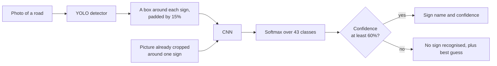
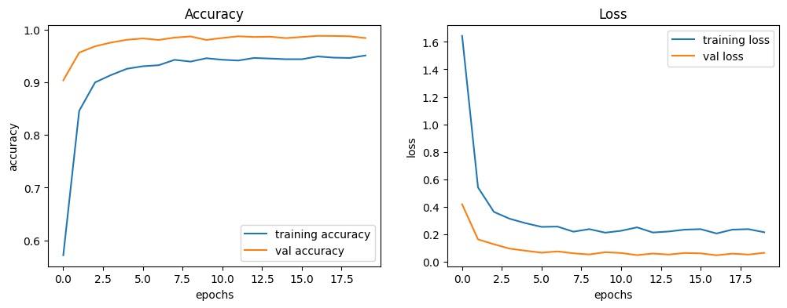

# Traffic Sign Recognition CNN

Our final year B.Tech (Computer Engineering) project at S.S.V.P.S.'s B.S. Deore College of Engineering, Dhule (2021-22).
By Neel Borse, Yashwant Patil, Kadambari Jadhav and Dipika Patil, guided by Prof. B. R. Mandre.
Project report title: "Deep Learning for Large-Scale Traffic-Sign Detection and Recognition".

In this project we trained a convolutional neural network (CNN) that recognises 43 types of traffic sign from the German
Traffic Sign Recognition Benchmark (GTSRB), and a YOLO detector that finds where the signs are in a full road photo. Together
they take a photo of a road and return every sign in it, boxed and named. We also built a website and a desktop app to try
both on your own pictures.

Our CNN recognises 95.1% of the GTSRB test images, and on road photos the two models together find and correctly name 97.5%
of all the signs.



## Project structure

| Path | What it is |
|---|---|
| `Dataset/` | GTSRB images: `Train/0` to `Train/42` (39,209 images), `Test/` (12,630 images, labels in `Test.csv`) and `Meta/` (one example per class) |
| `algo/tsr.py` | Class names, image loading, preprocessing and prediction, shared by the scripts below |
| `algo/train.py` | Trains our CNN, saves it to `algo/model/TSR.keras` and writes graphs and test metrics to `algo/results/` |
| `algo/detect.py` | Finds the signs in a photo and names each one: the detector and the CNN working together |
| `algo/prepare_gtsdb.py` | Turns the downloaded GTSDB photos into the layout YOLO expects |
| `algo/train_detector.py` | Trains the detector on those photos |
| `algo/evaluate_detector.py` | Measures both models together on the GTSDB test photos |
| `algo/video.py` | Runs the same thing on a video file or a webcam |
| `algo/Traffic_app.py` | Flask server for our website, with the `/predict` and `/detect` endpoints the Prediction page uses |
| `algo/gui.py` | Our desktop app (Tkinter) |
| `algo/model/TSR.keras` | Our trained CNN |
| `algo/model/sign_detector.pt` | Our trained detector |
| `algo/results/` | Graphs, confusion matrix and metrics from training and evaluation |
| `algo/Traffic_sign_detection.ipynb` | Google Colab notebook version of the CNN training. It expects the dataset on Google Drive; use `train.py` to train locally |
| `website/` | Home, Abstract, Prediction and Conclusion pages, served by `Traffic_app.py` |
| `website/sample-road.jpg` | A road photo to try detection with |
| `website/prototype/` | UI prototype of the website (PDF and exported HTML) |

## Setup

You need 64-bit Python 3.10 to 3.13 on Windows x64, Linux x86_64/aarch64 or macOS 12+ on Apple Silicon.
TensorFlow 2.21 has no builds for Python 3.14, Intel Macs or Windows on ARM. The libraries take about 5 GB.

**Windows** (PowerShell or Command Prompt), from the project folder:

```
py -3.10 -m venv .venv
.venv\Scripts\python -m pip install -r requirements.txt
```

Use any installed version from 3.10 to 3.13 (`py --list` shows them). You don't need to activate the environment, because the
commands below run `.venv\Scripts\python` directly. In Git Bash, write the paths with forward slashes (`.venv/Scripts/python`).

- If `pip install` fails with a hint about long paths, move the project to a short folder such as `C:\Projects\` or enable long path support in Windows.
- If TensorFlow reports that `msvcp140_1.dll` is missing, install the [Microsoft Visual C++ Redistributable (x64)](https://aka.ms/vs/17/release/vc_redist.x64.exe).

**macOS / Linux:**

```
python3 -m venv .venv
.venv/bin/python -m pip install -r requirements.txt
```

On Debian/Ubuntu, install `python3-venv` first, plus `python3-tk` for the desktop app. With Homebrew Python, the desktop app needs `python-tk`.
In the commands below, use `.venv/bin/python` instead of `.venv\Scripts\python`.

**Using an NVIDIA GPU (optional).** The PyTorch from `requirements.txt` runs the detector on the processor, which is fine for
single photos. For faster detection, and much faster detector training, install the CUDA build instead:

```
.venv\Scripts\python -m pip install torch torchvision --index-url https://download.pytorch.org/whl/cu130
```

`cu130` is CUDA 13, which suits recent cards; pick the index that matches your driver.

## Run the website

```
.venv\Scripts\python algo\Traffic_app.py
```

Open http://127.0.0.1:5000 and go to **Prediction**. There are two buttons:

- **Predict** names a picture that is already cropped around a single sign. Images from `Dataset/Test` are good to try; their correct classes are in `Dataset/Test.csv`.
- **Find signs in photo** takes a whole road photo, draws a box around every sign it finds and names each one. Try `website/sample-road.jpg`.

If port 5000 is already in use (on macOS the AirPlay Receiver uses it), start the site on another port instead:
`.venv\Scripts\python -m flask --app algo/Traffic_app.py run --port 5001`

## Run the desktop app

```
.venv\Scripts\python algo\gui.py
```

Click **Select a traffic sign**, choose a picture, then either **Recognize the Sign ?** for a cropped sign or
**Find signs in photo** for a full road photo.

## Find signs from the command line

```
.venv\Scripts\python algo\detect.py website\sample-road.jpg --out found.jpg
```

This prints a line per sign and saves a copy of the photo with the boxes drawn on it.

For video or a webcam:

```
.venv\Scripts\python algo\video.py clip.mp4 --save annotated.mp4
.venv\Scripts\python algo\video.py
```

Press q to close the window. On our laptop (RTX 5070) this runs at about 2.7 frames a second on 1360x800 video; smaller
frames run faster.

## Train the models

Both trained models are included, so these steps are only needed if you change something.

**The CNN**, on the GTSRB images already in `Dataset/`:

```
.venv\Scripts\python algo\train.py
```

Options: `--epochs` (default 20) and `--batch-size` (default 32). It takes about 6-7 minutes on a modern processor.

**The detector**, on GTSDB road photos, which are not in this repository. Download
[FullIJCNN2013.zip](https://sid.erda.dk/public/archives/ff17dc924eba88d5d01a807357d6614c/FullIJCNN2013.zip) (1.7 GB), then:

```
.venv\Scripts\python algo\prepare_gtsdb.py --zip FullIJCNN2013.zip
.venv\Scripts\python algo\train_detector.py --device 0
.venv\Scripts\python algo\evaluate_detector.py
```

The first command unpacks the 900 photos and converts their boxes into `Dataset/GTSDB` (about 2.8 GB, not committed). The
second trains YOLO11n at 1024 pixels for 100 passes, which took 2.8 hours on our laptop GPU; use `--device cpu` if you have no
NVIDIA card, and expect it to take far longer. The third measures both models together on the 300 test photos.

## Model

Our CNN converts each image to RGB and resizes it to 30x30. The pixel values go into the network as they are (0-255), without
normalisation or data augmentation. We split `Dataset/Train` 80/20 into training and validation sets, and evaluate the
final model on the separate GTSRB test set.

| # | Layer |
|---|---|
| 1 | Conv2D, 32 filters, 5x5, ReLU |
| 2 | Conv2D, 32 filters, 5x5, ReLU |
| 3 | MaxPool2D, 2x2 |
| 4 | Dropout, 0.25 |
| 5 | Conv2D, 64 filters, 3x3, ReLU |
| 6 | Conv2D, 64 filters, 3x3, ReLU |
| 7 | MaxPool2D, 2x2 |
| 8 | Dropout, 0.25 |
| 9 | Flatten |
| 10 | Dense, 256, ReLU |
| 11 | Dropout, 0.5 |
| 12 | Dense, 43, Softmax |

We train with categorical cross-entropy loss and the Adam optimiser, for 20 epochs with batch size 32.

The detector is YOLO11n (2.6 million parameters) with a single class, "traffic sign". It only has to find signs; naming them
is the CNN's job, which is the better split because GTSDB has few examples of each sign type while GTSRB has 39,209 crops.

## Results

### Recognising a cropped sign

| Data | Accuracy |
|---|---|
| Training | 95.1% |
| Validation (20% of `Train`) | 98.4% |
| Test (12,630 unseen images) | 95.1% |

On the test set, precision and recall (averaged over the 43 classes) are 92.9% and 92.8%.

- We quote the test figure. GTSRB's training images come in sequences of about 30 photos of the same physical sign, and a random
  split puts photos of every sign in both the training and validation sets, so validation accuracy is optimistic.
- Training accuracy is lower than validation accuracy because dropout is only active during training.
- Our weakest classes on the test set are Pedestrians (50% of 60 images), End of no passing (73%), Beware of ice/snow (81%),
  End of speed limit 80 km/h (83%) and Slippery road (83%).



The full [confusion matrix](algo/results/confusion_matrix.png) shows most mistakes are between signs that look alike at 30x30 pixels,
for example 60 vs 80 km/h, 100 vs 120 km/h, "Right-of-way at intersection" vs "Beware of ice/snow", and "Slippery road" vs "Wild animals crossing".

### Finding signs in a road photo

Measured on the 300 GTSDB test photos, which hold 361 signs between them:

| Measure | Result |
|---|---|
| Signs found (box overlapping the real one by at least half) | 353 of 361 (97.8%) |
| Found **and** named correctly | 352 of 361 (97.5%) |
| Named correctly among the signs that were found | 99.7% |
| Boxes that were not signs | 18 in 300 photos (0.06 per photo) |
| Detector on its own (mAP50 / mAP50-95) | 99.3% / 88.1% |

If we skip the detector and use the boxes a human drew, the CNN names 99.4% of those signs correctly. So almost all of the
remaining error comes from the eight signs the detector never finds, not from naming them.

## Limitations

- **The detector learned from German roads.** GTSDB is daylight photos taken from a car in Germany. Signs from other countries,
  night scenes, rain or heavy motion blur are outside what it has seen.
- **Small and distant signs are the ones missed.** In the training photos signs are 16 to 127 pixels wide, and the eight the
  detector misses are mostly at the small end.
- **A few boxes are not signs.** About one photo in 17 gets a box around something else. The 60% confidence rule hides most of
  these, but a round red object can still be named as a sign.
- **Rejecting non-signs only partly works.** When the top confidence is below 60%, our apps say no sign was recognised. That catches blank
  and noise images and 40% of the CNN's mistakes on the test set, at the cost of 1.1% of its correct answers. Ordinary photos with no
  clear sign can still get a confident, wrong label.
- **Rotation and blur.** Rotating the test images by 15° lowers the CNN's accuracy to 83%, and by 30° to 29%. A strong blur lowers it to about 64%.
- **Video is not real time.** About 2.7 frames a second on our laptop at 1360x800.
- Clip-art sign icons, such as the ones in `Dataset/Meta`, are less reliable than photos.

## Data and credits

- **GTSRB dataset (recognition):** J. Stallkamp, M. Schlipsing, J. Salmen and C. Igel, "The German Traffic Sign Recognition Benchmark: A multi-class
  classification competition", IJCNN 2011. The dataset's creators ask for this paper to be cited.
- **GTSDB dataset (detection):** S. Houben, J. Stallkamp, J. Salmen, M. Schlipsing and C. Igel, "Detection of Traffic Signs in
  Real-World Images: The German Traffic Sign Detection Benchmark", IJCNN 2013. `website/sample-road.jpg` is one of its photos.
- **Detector:** Ultralytics YOLO11, used under the AGPL-3.0 licence.
- **Related work we studied for the project report:** D. Tabernik and D. Skočaj, "Deep Learning for Large-Scale Traffic-Sign Detection
  and Recognition", IEEE Transactions on Intelligent Transportation Systems 21(4), 2020. [arXiv:1904.00649](https://arxiv.org/abs/1904.00649)
- **Website photos:** Jeremy Bezanger on Unsplash (Home), Martin Dusek on Pexels (Abstract), Yena Kwon on Unsplash (Conclusion).
  The source of the Prediction page background is unknown.
